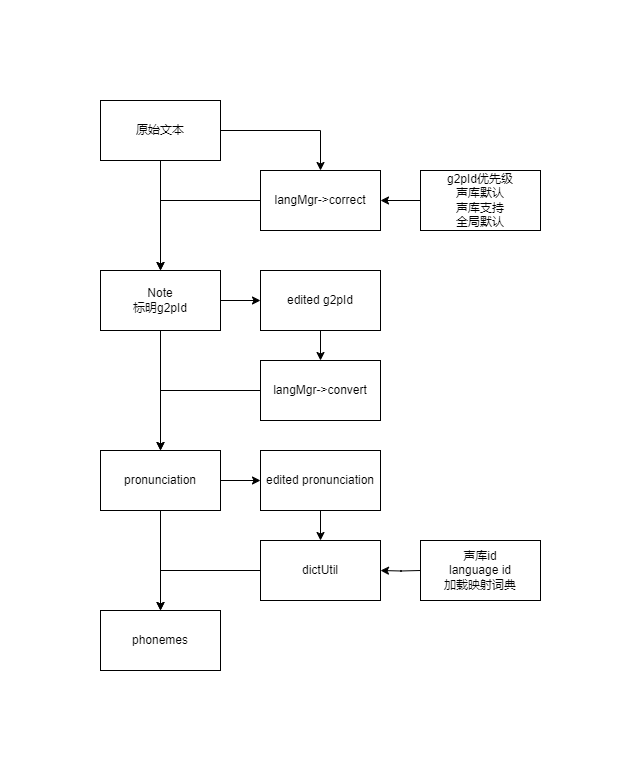

# language-manager

## Intro

The G2p module is used for text to speech conversion, and its subordinate LanguageAnalyzer recognizes the language of
the
current G2p.

Provide support for the [dsinfer](https://github.com/diffscope/dsinfer/blob/main/docs/ds-spec-2.3.md) format sound
library for [ds-editor-lite](https://github.com/flutydeer/ds-editor-lite).

## Optional G2P

|    G2p Id    |        Details        | Language Id      |
|:------------:|:---------------------:|------------------|
|  cmn-pinyin  |    Mandarin Pinyin    | cmn cmn-pinyin   |
| yue-jyutping |       Jyutping        | yue yue-jyutping |
|  jpn-romaji  | Japanese Romanization | kana jpn-romaji  |
|     eng      |        English        | eng              |
|   unknown    |        Unknown        | unknown          |

## Call Flow



## How To Use

```c++
const auto langMgr = ILanguageManager::instance();  // 获取单例
const auto langFactory = langMgr->language("cmn");  // 获取g2p

QList<LangNote *> langNotes;    // 构建输入结构体
langNotes.append(new LangNote("xxx好的123"));  // 混合文本
langMgr->correct(langNotes);    // 为g2pId为unknown的结构体标注
langMgr->convert(langNotes);    // 按分析结果、调用相应G2p转换

// 将混合语言的文本拆分为QList<LangNote>并标记语种、分类，priorityG2pIds为强制优先的g2pId（下属languageAnalyzer的分析）
QList<LangNote> split(const QString &input, const QStringList &priorityG2pIds = {});
// 为g2pId为unknown的结构体标注
void correct(const QList<LangNote *> &input, const QStringList &priorityG2pIds = {}) const;
// 按分析结果、调用相应G2p转换
void convert(const QList<LangNote *> &input) const;
// 按分析字符串语种
QString analysis(const QString &input, const QStringList &priorityG2pIds = {}) const;
QStringList analysis(const QStringList &input, const QStringList &priorityG2pIds = {}) const;
```

## Dependencies

Temporarily using the vcpkg environment of [ds-editor-lite](https://github.com/flutydeer/ds-editor-lite).

[cpp-pinyin](https://github.com/wolfgitpr/cpp-pinyin)

[cpp-kana](https://github.com/wolfgitpr/cpp-kana)

```bash
-DCMAKE_TOOLCHAIN_FILE=path/to/vcpkg/scripts/buildsystems/vcpkg.cmake
-DCMAKE_PREFIX_PATH=path/to/qt/6.7.3/msvc2022_64;
-DCMAKE_INSTALL_PREFIX=install
```

## Add New G2p

Referring to the 3-digit code in [iso-639-3.tab](./docs/iso-639-3.tab), add a suffix of '-' to the commonly used
phonetic notation system, such as "eng", "cmn-pinyin", "jpn-romaji".

Name the new G2p according to the standard and add it to the above table.

Refer to [LanguageAnalyzer](./docs/LanguageAnalyzer) and [G2pFactory](./docs/G2pFactory) to develop two modules, and add
them to Language Manager.