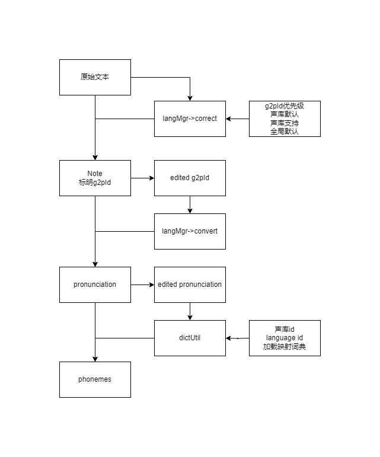

# language-manager

## Intro

A C++17 plugin-based G2p (Grapheme-to-Phoneme) framework with modular language processing capabilities.

Provide support for the [dsinfer](https://github.com/diffscope/dsinfer/blob/main/docs/ds-spec-2.3.md) format sound
library for [ds-editor-lite](https://github.com/flutydeer/ds-editor-lite).

> **Note**: Text splitting (Splitter) and language tagging (Tagger) have been moved to the frontend. The core framework focuses on plugin management, dependency resolution, and G2p conversion.

## Optional G2P

|    G2p Id    |        Details        | Language Id      |
|:------------:|:---------------------:|------------------|
|  cmn-pinyin  |    Mandarin Pinyin    | cmn cmn-pinyin   |
| yue-jyutping |       Jyutping        | yue yue-jyutping |
|  jpn-romaji  | Japanese Romanization | kana jpn-romaji  |
|   eng-cmu    |        English        | eng              |
|   unknown    |        Unknown        | unknown          |

## Call Flow



## How To Use

```c++
#include <LangCore/Core/Manager.h>

const auto langMgr = LangCore::Manager::instance();

// Initialize Manager
std::string errorMessage;
if (!langMgr->initialize(errorMessage)) {
    std::cerr << "Failed to initialize: " << errorMessage << std::endl;
    return -1;
}

// G2p conversion (splitting and tagging are done by the frontend)
std::vector<LangCore::G2pInput *> g2pInput;
g2pInput.emplace_back(new LangCore::G2pInput("hello", "eng-cmu"));
g2pInput.emplace_back(new LangCore::G2pInput("你好", "cmn-pinyin"));
auto results = langMgr->convert(g2pInput);

// Cleanup
for (auto *input : g2pInput) {
    delete input;
}
```

## Dependencies

Temporarily using the vcpkg environment of [ds-editor-lite](https://github.com/flutydeer/ds-editor-lite).

- [cpp-pinyin](https://github.com/wolfgitpr/cpp-pinyin)
- [cpp-kana](https://github.com/wolfgitpr/cpp-kana)
- ONNX Runtime
- nlohmann-json
- Qt 6 (test infrastructure)

```bash
cmake -B build ^
  -DCMAKE_TOOLCHAIN_FILE=path/to/vcpkg/scripts/buildsystems/vcpkg.cmake ^
  -DCMAKE_PREFIX_PATH=path/to/qt/6.10.2/msvc2022_64 ^
  -DCMAKE_INSTALL_PREFIX=install ^
  -DLANGMGR_BUILD_PLUGINS=ON ^
  -DLANGMGR_BUILD_TESTS=ON

cmake --build build --config Debug
ctest --test-dir build -C Debug
```

## Add New G2p

Referring to the 3-digit code in [iso-639-3.tab](./docs/iso-639-3.tab), add a suffix of '-' to the commonly used
phonetic notation system, such as "eng-cmu", "cmn-pinyin", "jpn-romaji".

Name the new G2p according to the standard and add it to the above table.

Refer to [PRD](./docs/PRD-v2.0.md) and [Plugin Development Guide](./docs/Plugin-Development-Guide.md) for development details.